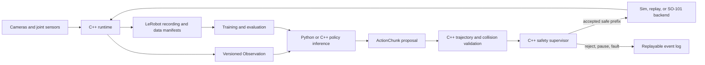

# Architecture

The control plane is deliberately asymmetric: learned components can propose,
but only the C++ supervisor can authorize motion.

## Boundaries

### Python and PyTorch

Own LeRobot integration, environments, datasets, policies, training,
evaluation, research orchestration, and portable reference implementations.
Python may request motion but does not own the servo bus.

### C++

Own process lifecycle, bounded queues, timestamps, command arbitration, safety
state, fault handling, recording, replay, hardware abstraction, and numerical
robotics. Numerical components include kinematics, Jacobians, IK, trajectory
interpolation, collision checks, calibration solvers, and optional native
inference. It exposes a stable C ABI or Python bindings where cross-language
integration is required.

### CUDA

Own only profiled bottlenecks with a portable fallback. Candidate operations
include fused RGB-D unprojection, filtering, voxel aggregation, and batched
action scoring.

### Protocols

Protobuf is the wire and durable-log source of truth. Locally, high-bandwidth
image payloads may use shared memory while messages carry references and
metadata. Remote tools use gRPC. Every sample and action includes a monotonic
timestamp, sequence number, schema version, calibration version, and frame IDs.

## Dependency direction

Projects and apps may depend on shared packages. Shared packages never depend
on projects or apps. Simulation, hardware, and replay implement a common
logical contract. Training consumes datasets and environment adapters without
importing hardware implementations.

## Safety invariant

No policy, UI, notebook, or remote service receives direct actuator authority.
The supervisor rejects stale, malformed, out-of-bounds, discontinuous, or
collision-risking commands and records a machine-readable decision.
